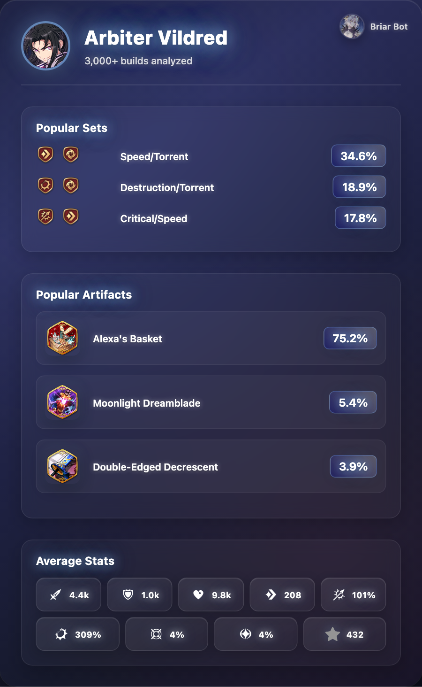

# 🌙  BriarBot

*"The witch stirs... speak your desires, mortal."*

A Discord bot that provides Epic Seven character build analysis and statistics.

<div align="center">

</div>

## What BriarBot Does

- **Build Statistics** - Average stats from thousands of players
- **Popular Gear Sets** - Most used set combinations
- **Artifact Recommendations** - Popular artifact choices
- **Visual Reports** - Clean stat cards with build data
- **Server Integration** - Seamless discord server integration


## Commands

```
!arbiter vildred    → Get Arbiter Vildred build data
!luna               → Get Luna build data
!seaside bellona    → Get Seaside Bellona build data
```

## Setup

1. **Install Dependencies**
   ```bash
   npm install
   ```

2. **Configure Bot Token**
   - Set your Discord bot token in `.env`
   - Grant bot permissions: Read Messages, Send Messages, Attach Files

3. **Start the Bot**
   ```bash
   npm start
   ```

## Testing

```bash
npm test                 → Run automated test suite
npm run test:interactive → Interactive testing mode
```

The test suite includes:
- Character search functionality
- Full workflow testing (data analysis + image generation)  
- Cache system validation
- Performance benchmarks

## Built With

- **Node.js** - Runtime environment
- **Discord.js** - Discord API integration  
- **Puppeteer** - Web scraping and image generation
- **Axios & Node-Fetch** - HTTP requests
- **Docker** - Containerized deployment
- **PM2** - Process management
- **[Fribbels Epic 7 Optimizer](https://github.com/fribbels/Fribbels-Epic-7-Optimizer)** - Build data source

---

*☾ The witch awaits your command...*